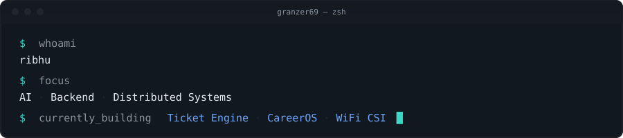
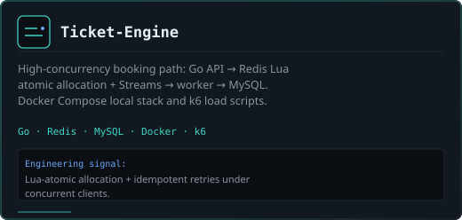
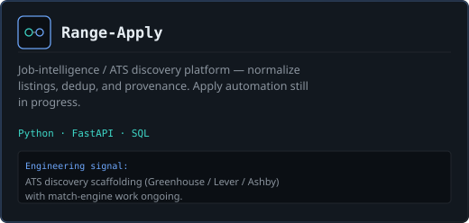
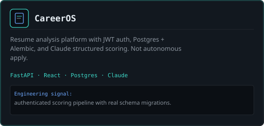
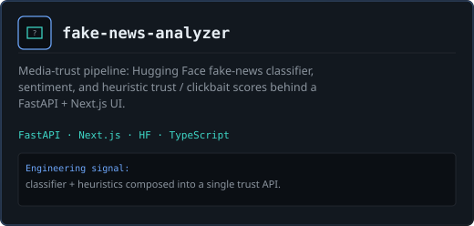
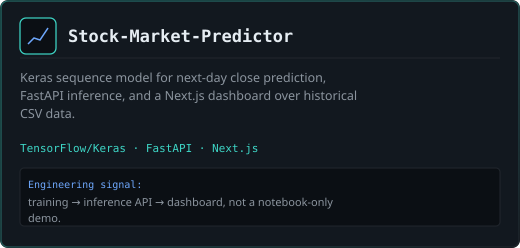
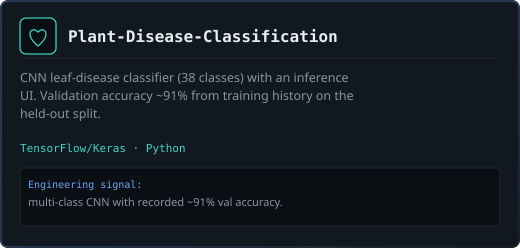
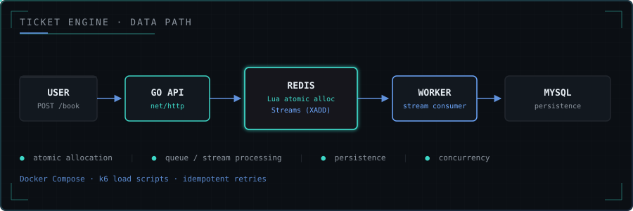

**Backend & AI systems engineer** — concurrent Go/Redis services, FastAPI platforms, and applied ML wired into real APIs.

B.Tech CSE (Data Science) @ MGIT, Hyderabad · Open to AI/ML & backend internships

<table>
  <tr>
    <td width="50%" valign="top">
      
    </td>
    <td width="50%" valign="top">
      
    </td>
  </tr>
  <tr>
    <td width="50%" valign="top">
      
    </td>
    <td width="50%" valign="top">
      
    </td>
  </tr>
  <tr>
    <td width="50%" valign="top">
      
    </td>
    <td width="50%" valign="top">
      
    </td>
  </tr>
</table>

- **Redis owns hot allocation** — Lua script does atomic pop + idempotent user book; Streams carry the persist event.
- **Worker persists sold state to MySQL** — eventual consistency by design; durable ownership lives in MySQL.
- **Load path is instrumented** — Docker Compose stack + k6 scripts (benchmark numbers not published yet).

**Languages** · Go · Python · TypeScript · C · Java · SQL

 

 

**Backend** · FastAPI · Redis · MySQL · Postgres

 

 

**Frontend** · React · Next.js

 

 

**AI / ML** · TensorFlow / Keras · scikit-learn · Hugging Face · Claude

 

&nbsp;

&nbsp;

&nbsp;

 

**Infra** · Docker · Git · Linux · k6

 

&nbsp;

<!-- Contribution snake: requires .github/workflows/snake.yml (Platane/snk) to run once.
     After the action publishes to the `output` branch, uncomment:

-->

&nbsp;&nbsp;

&nbsp;&nbsp;

misc

 

The Earth is flat — funniest thing you'll ever hear. (It's not. I just keep the bit.)

